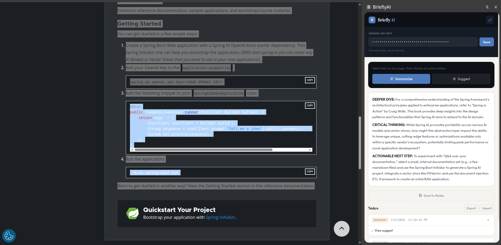

# BrieflyAI

A Chrome Extension with Spring Boot backend that summarizes selected text using Google Gemini AI and stores notes locally.



## How It Works

```bash
Chrome Extension ←→ Spring Boot Backend ←→ Google Gemini API
```

1. Select text on any webpage
2. Click "Summarize" in the extension side panel
3. Backend sends text to Gemini API for processing
4. Summary appears in the side panel
5. Optionally save notes (stored locally in browser)
6. Export and import notes (stored in JSON file)

## Project Structure

```bash
BrieflyAI/
├── extension/          # Chrome Extension (Manifest V3)
│   ├── manifest.json
│   └── src/
│       ├── sidepanel.html
│       ├── sidepanel.js
│       ├── sidepanel.css
│       └── background.js
└── server/            # Spring Boot 4.0.0 (Java 21)
    ├── pom.xml
    └── src/main/java/
```

## Prerequisites

- Java 21
- Chrome browser
- Google Gemini API key ([Get one here](https://makersuite.google.com/app/apikey))

## Setup & Run

### 1. Start Backend

```bash
cd server/
./mvnw spring-boot:run
```

####
```bash
cd server/
docker build -t brieflyai .
docker run -p 8080:8080 brieflyai
```

Backend runs at `http://localhost:8080`

### 2. Install Extension

1. Open `chrome://extensions/`
2. Enable "Developer Mode"
3. Click "Load unpacked" → select `extension/` folder
4. Pin extension to toolbar

### 3. Use Extension

1. Select text on any webpage
2. Open BrieflyAI side panel
3. Enter your Gemini API key
4. Click "Summarize"

## API

**POST** `/api/process`

```json
{
  "content": "Text to summarize",
  "operation": "summarize", 
  "apiKey": "your-gemini-api-key"
}
```

Returns plain text summary.

## Testing

### Test Backend API

```bash
curl -X POST http://localhost:8080/api/process \
  -H "Content-Type: application/json" \
  -d '{
    "content": "Your text here",
    "operation": "summarize",
    "apiKey": "your-api-key"
  }'
```

### Test Extension

1. Go to any webpage with text
2. Select some text
3. Open extension side panel
4. Click "Summarize"

## Features

- **AI Summarization**: Powered by Google Gemini
- **Local Notes**: Save research notes per URL (stored in browser)
- **Privacy**: Notes never leave your browser
- **No Account**: Works entirely locally
